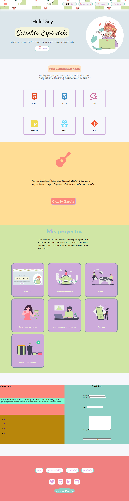

# Portfolio de Ada

### Este es un proyecto destinado a generar un agradable impacto visual. Con armonia en la combinación de los colores y la agradable sensación de volver a ser un niño con imagenes animé
 

### Si quieres ver como quedó puedes darle amor con tu click con este [enlace](https://tender-panini-774525.netlify.app/) o puedes hacerlo desde [acá]()

 

***

### si quieres tener el código en tu computadora, deberás de seguir estos pases en tu terminal.

- Ir al [repositorio](https://github.com/gri-espindola/proyecto-ada) - darle click al botón de folkear
- Darle click al botón de code
- Copiar la url
- Abrir tu terminal y poner el comando de **git clone <url>**
- Entrar a la carpeta del proyecto y abrirlo en tu IDE 

### Este proyecto no necesita la instalación de ninguna dependencia, por ahora!

 

***

### Este debería ser el resultado final de tu instalación 

 

***

### Este portfolio fue desarrollado en mi cursada de Ada. Agradezco a [Jonh]() y a [Leydi]() por su ayuda proporcionada 

#### De Gri con ❤ para ustedes!